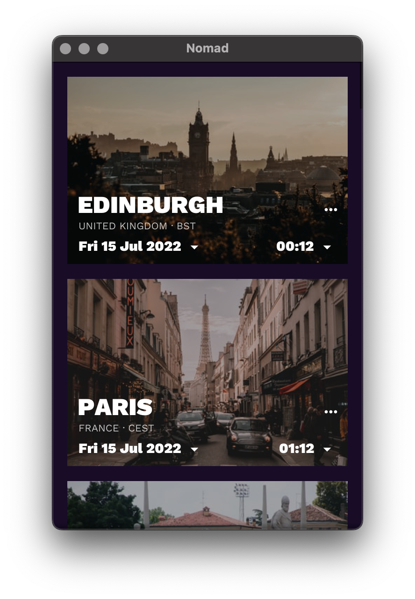
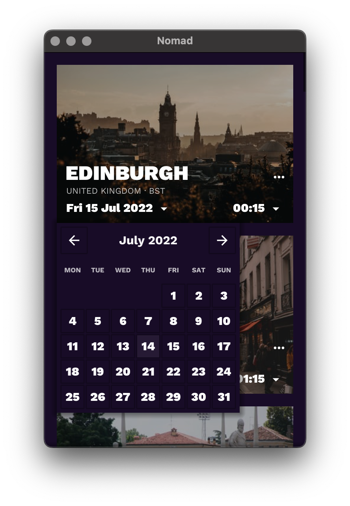
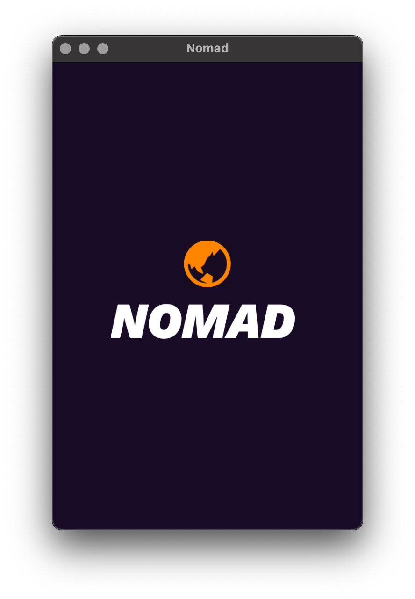

# Nomad

Nomad is a timezone converter app that can help with travel planning, scheduling
international meetings or general curiosity.

The design is implemented as a custom Fyne theme to show how branding can be
applied to a standard [Fyne](https://fyne.io) application.

## City images

The city images are downloaded dynamically from the [Unsplash](https://unsplash.com) service.
To enable this feature you will need an API key from Unsplash.
You should set that into an environment variable `UNSPLASH_ACCESS_KEY`.

## Screenshots

